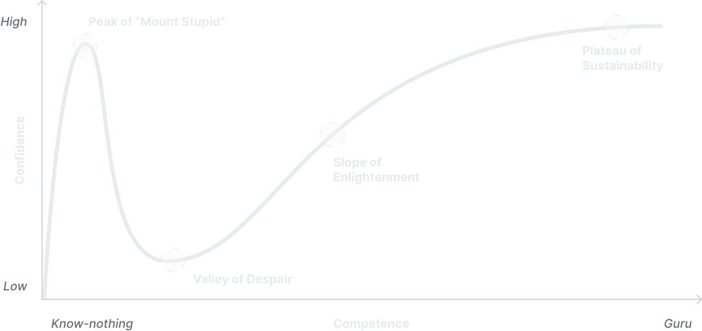
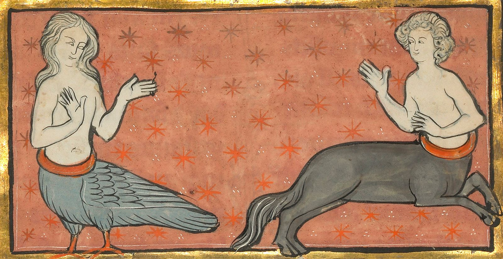
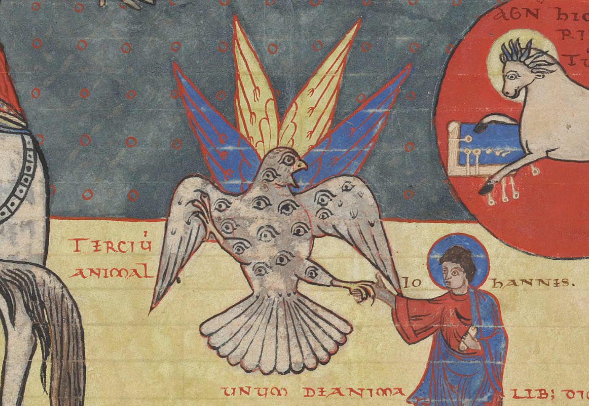
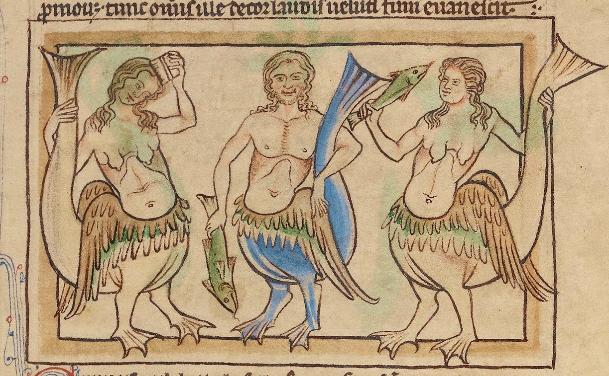

I set out to write this article right after fixing the leaking sink. It wasn't a big deal — I simply untwisted some parts, cleaned up others, rubbed the filler ring a bit, and placed it back. I'm not a plumber, but I'm capable of identifying the interactive components of mechanisms. Frankly speaking, telling my wife that there was no leak anymore felt great. Since I could hardly ever be caught doing this kind of stuff, it was pretty easy to exceed expectations.

My current self-estimated house repair level is "if I had the tools, there's nothing I couldn't fix." I bet most of you have already heard about [the Dunning-Kruger effect](https://en.wikipedia.org/wiki/Dunning%E2%80%93Kruger_effect) — the relationship between the level of confidence and the level of competence:

 

<figcaption align="center">
  The most famous visualisation of the Dunning-Kruger effect curve
</figcaption>

Now, I'm proudly standing right next to _the Peak of "Mount Stupid"_ with my handyman skills, from where I can brag about my modest record of achievements. Here comes the joy of being an amateur — reaching the graph's highest confidence point doesn't take much effort. The key to maintaining peace of mind is to put the tools away and avoid going further down the road to _the Valley of Despair_.

Despite the theory being debatable, I've had a very similar experience with design and coding (where I've just started to scramble out of the lowest confidence point). For a long period, while mentioning the Dunning-Kruger effect, I used to focus on the _"know-nothing"_ part only and treat it as a joke about overly confident beginners. But now my attention is drawn to how the graph becomes almost flat after reaching the plateau at some maturity level. The waviness of the line in the beginning reflects the emotional ups and downs we experience. But then it becomes completely flat.

 

<figcaption align="center">
  A Siren and a Centaur (detail) in a bestiary, 1278–1300, unknown author,
  Franco-Flemish.
</figcaption>

Starting in a new area, each day we learn a lot and our amateur achievements make us exude dopamine. Each week is a breakthrough. Each month you consider updating your resume. Each year you try on a new seniority badge. But this tempo doesn't last forever — at some point, you reach the plateau. Now you no longer exceed expectations but prove your authority. You are a grownup and supposed to be a person with answers. The transition might feel especially itchy if you have a competitive spirit and younger colleagues around with their annoyingly evident progress.

What happens at that point? If you are serious about what you are doing, you can sharpen your focus, master the domain, dig deeper than anyone else, and become an indispensable specialist in [biomimetic micro-air vehicle design for pollination drones](https://www.mdpi.com/2313-7673/7/2/69) that substitute the depleting bee population. While the example might seem a bit cartoonish, it represents the type of professional I deeply respect and envy a little — there's hardly anything more exciting than listening to an expert talking about what they know best. That’s the path of Specialist, someone who holds expertise in a specific area.

 

<figcaption align="center">
  Commentary on the Apocalypse Book, Beatus of Liébana, around the XI century,
  Spain.
</figcaption>

But to be honest, not everyone enjoys the marathon. Achievements, long waited and well-deserved achievements undisputedly cheer us up. But in this article I wanted to focus on the continuous day-to-day process of growth or we may use a vague notion [“lifelong learning”](https://en.wikipedia.org/wiki/Lifelong_learning). So that being a conscientious dopamine addict I could look at myself back in months or years and admit that some progress was made.

So if we don't want to lose the initial _“know-nothing”_ growth tempo, there are many options for spicing things up after reaching the plateau. One can try changing the role and join a managing or business career chase. If one is eager to share their knowledge, they might start mentoring or engaging in educational activities. Alternatively, one can finally heave a sigh of relief and focus on their personal life, exploring interests like interior design, sports, winery, or something of their choice. Or anything else, or everything at once. All those examples imply starting something new.

 

<figcaption align="center">
  Sirens (detail) in the Northumberland Bestiary, about 1250–60, unknown author,
  England.
</figcaption>

In my example, I've been seduced by almost every collateral expertise domain, becoming a Swiss Army knife man. Not the one [impersonated by Daniel Radcliffe](https://www.imdb.com/title/tt4034354/), I'm rather talking about [T-shaped](https://en.wikipedia.org/wiki/T-shaped_skills), even [M-shaped](https://www.mad.co/insights/the-mad-m-shaped-person) (if it is a real thing) specialists. I prefer the term [generalist](http://agilemodeling.com/essays/generalizingSpecialists.htm) — someone competent in several different fields or activities. I partially attribute my eagerness to dive into new areas to the missing joy of evident progress. Luckily, as opposed to a real Swiss Army knife, being a generalist appeared to be [a much more applicable thing](https://www.proofofconcept.pub/p/mastery-for-generalists).

Ultimately, the choice between specialising in a niche domain or becoming a generalist is a deeply personal one, shaped by individual preferences and life circumstances. The path of a generalist may come with its share of uncertainties and a lack of clear direction. The breadth of knowledge might not always guarantee success or recognition — we rarely call a “decent specialist in several domains” an outstanding person. But you hardly can build prospering businesses in fintech, automotive, and space industries while shaking up social media and the stock market with tweets without having versatile expertise, including logo design ([there might be room for growth though](https://techcrunch.com/2023/04/03/twitters-new-homepage-logo-is-very-doge-y/)). So why not embrace the joy of being an amateur and let us dive into whatever attracts our interest?
