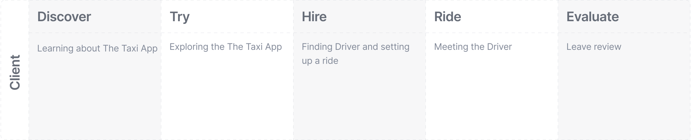

<Text
  css={{ marginBottom: "$48", color: "$text_secondary", lineHeight: "1.5" }}
>
  <em>
    This article is the second part of two and describes the ideation workshop
    based on <Link to="/virality">the first article</Link>, which is purely
    theoretical. I would recommend having a look at it before starting on this
    one.
  </em>
</Text>

Recently at work, we were talking about user acquisition and one of our goals was to boost the number of referrals. I’ve decided to go a bit deeper into the subject in order to help us with the idea generation.

So this virality workshop was designed as an ideation session based on the Viral Loop concept. It includes a theoretical overview of virality and a practical part aimed at enhancement of the product’s viral potential. I’ve already put the theoretical part separately, you can find it here (definitely recommend you to start with it). Now we are going to see how we can apply this information in practice.

For this overview let’s take a look at an imaginary taxi app. Let’s call it The Taxi App. It has two types of users - drivers and clients. So…

#### Goal

To evaluate viral potential of The Taxi App and find application of viral techniques.

#### Expected outcome

List of possible enhancements in order to increase the platform virality.

---

## Participants

Depending on how many roles you have, the number of participants may differ. We discovered two roles in The Taxi App, so we could group participants into two. I would recommend ~5 participants per group, so that collaboration within the groups doesn’t necessitate strict facilitation. If we have extra volunteers, we may assign the extra group to the same role, but it will extend the workshop duration.

As usual, it would be great to have different expertise within the groups - engineers, product people, analytics, support, etc.

In my case, I have created a calendar event and started collecting applications from anyone who is interested. Meanwhile, the product team have received the personal invites, so I’ve marked their attendance as ‘not so voluntary’.

---

## Format

One more thing to mention is that in my case, it was an online workshop since we have a remote team. For that, I’ve used [Whimsical](https://whimsical.com/) because it doesn’t require signing up for collaboration (one more example of demonstration virality). There I had all the materials organised in a way I could scroll from the “slide-like” theory areas to canvases prepared for team collaboration. I’ve been pasting the required materials from the template file according to our progress, so that it won’t distract the participants. I must admit, you should make sure to rehearse beforehand to achieve the eloquent choreography of your scrollings, zoomings and pastings. Otherwise, you’ll have to beg a bunch of pardons.

---

## Structure

It's great to have 2,5–3 hours for it. Two rounds with a brief break. I'll provide very rough estimations, you can adjust them according to your guest list and tempo.

1. **[About Virality:](#about-virality)** 15 min _/Theory_
2. **[Warmup #1 - Recommendations:](#warmup-recommendations)** 10 min
3. **[Overview of in use mechanisms:](#examples-overview)** 10 min _/Theory_
4. **[Diving into the Roles:](#roles)** 15 min
5. **[Presenting findings within the roles:](#roles-findings)** 10 min
6. _----------(Break: 10 minutes)----------_
7. **[Warmup #2 - Recollections:](#warmup-recollections)** 5 min
8. **[Group Ideation:](#group-ideation)** 20 min
9. **[Presentation:](#presentation)** ~15 min each team

---

## And here comes the workshop

###  1. About Virality

This part is a pure theory, which I wound not repeat here - you can use [this article](/virality). This section includes:

1. #### What is virality technically
   It is a brief explanation of what is called virality
2. #### Virality types
   Here we describe what forms the virality takes
3. #### Common traits
   It contains some words on what viral products have in common.

At the end of this stage we already know that virality can function differently, it usually doesn’t appear out of nothing and, last but not least, we share the terminology.

---

###  2. Warmup #1 - Recommendations

It’s a very important step, here we are about to realise that virality is all around us. And some things deserve to be recommended, while some don’t.

For this exercise, we ask the participant to recommend us something. For this purpose they have to fill in a simple card, containing the fields:

1. #### What do you want to recommend to us?
   Basically, It will be the card’s title.
2. #### How did you learn about it?
   Quite often here is where you’ll find an example of virality.
3. #### Why should we like it?
   This question is to really be asked a lot half an hour later, when analysing The Taxi App.

Let’s provide 3-5 minutes for filling in and 5-7 more for reading them (depending on how many participants we have).

During this warmup we are making referrals alongside remembering how we all were a part of it (most likely). After going through the theory we provide real-world examples.

---

###  3. Overview of in use mechanisms

There are some more categorised examples of tools companies use to make us their ambassadors:

It’s showing us some more tricky or not so obvious ways to reach the audience. We’re about to use it in regard to The Taxi App. That is the last theoretical piece and you can find it in [the first article](/virality).

---

###  4. Diving into the Roles

We’ve already practised those questions during the first warmup. Now it’s time to address The Taxi App. We want to evaluate our product from an outside perspective as we did for the other ones.

As we decided, we have two teams and two roles. Let one concentrate on the Clients while the other one will be occupied with the Drivers. For this activity we leave the participants working in groups over canvases dedicated to their role. I’d recommend that the facilitator visits each group from time to time just to help them keep on schedule or in case there are any questions.

We have a canvas with a set of questions about our roles:

1. #### What is The Taxi App for Clents in general?
   So what is our app from the customer’s point of view, and why would one hire it? Here we want to describe the jobs we do and think about the value we bring.
2. #### Who can do this job?
   Let’s list who can perform those jobs and with who do we compete.
3. #### Why do Clents get interested in The Taxi App?
   Why should they come to us? What are our advantages, and what is different about our app?
4. #### Why would Clents talk about The Taxi App?
   We have chosen something to recommend during the warmup, and, probably, some of the participants have shown some enthusiasm. And what about in our case - why should someone have a motive to mention The Taxi App?

At this stage, I’d welcome mentioning some hypothetical arguments as well - it will help us with the ideation step.

---

###  5. Presenting findings within the roles

Teams present their canvases one by one. It’s crucial to articulate the findings in public - it helps to reevaluate the ideas and to find more precise wordings. Let them add some ideas or correct the existing ones. And encourage engagement.

---

###  6. Break

A 10-minute break will help us not to get bored or exhausted. And we may hope the participants will have some time to process the first hour and the roles findings in the background.

---

###  7. Warmup #2 - Recollections

During the first hour, we went through quite a lot of examples of virality. To warm up a bit before the ideation, the facilitator can ask them to provide an example the participants liked most or at least remembered. Their own example may be perfect as well. It would be great if they can provide some categorisation, so that we can place other examples. You as a facilitator can direct through suggestive questioning. It may look like this:

– So, who would like to share the first example?  
– Spotify Wrapped - people bragging about their listening stats with Spotify's features and music library. It’s a Demonstration Virality.  
– Nice, any other examples of Demonstration Virality?  
– “Made with Squarespace” websites

And so on.

---

###  8. Group Ideation

This step is what we all came for today. At this point, we have already discussed a ton of examples of virality and mechanisms favouring virality. Then analysed our product’s value to the customers and the reasons they might talk about us. Now it’s the time to ideate how to increase virality and what we can invent to give our clients the tools and motives to become promoters.

This step is a group activity - each continues working on their role. With access to all the information provided during the previous steps, we ask them to think about how we can help the clients to spread the word about The Taxi App.

There is a canvas prepared for each role and it has sections based on the directions of interaction as shown below:

So how can a client make other potential clients or drivers know about us? 20 minutes is plenty for the list of rough ideas. We’ll shape them a bit during the next step.

---

###  9. Presentation

After the work in teams, it’s time to present the ideas. I prefer doing it with the help of a very high level CJM (Customer Journey Map):

There’s no need to be specific during this mapping, the purpose is to help to articulate the ideas better, and start to think about the feature a bit deeper. There might be ideas like “Start a blog” or “Share referral”. Afterwards, we ask to match the feature with a step, the ideas are most likely going to transform:

- “Start a blog” → “A blog on starting as a taxi driver and the legal stuff” or ”A nightlife digest” with "Book The Taxi App Limo" CTA;
- “Share referral” → “Get a discount while splitting a ride” or “Share some cheap ride details with your promo code, so your friend will get a discount and learn about how low was the price you’ve paid”.

This idea shaping process is the reason I wouldn’t put a strict time limits on this part. You can figure them out, accordingly to your timetable and the ambience in the room.

---

## Results

As a result, we expect to have a list of ideas aimed at providing your clients with motives and tools to spread the word about you. Furthermore, you had an opportunity to analyse what your product is or what you want it to be. As the next step, I’d advise going through [the Impact-Effort mapping](https://www.nngroup.com/articles/prioritization-methods/) or any other prioritisation process of your choice.

---

## Conclusion

I’ve intended this entire virality thing to be practical and actually do some good. In recent years virality has happened to become a buzzword and praised as a promised land... So, since you have just been anointed as a virality expert, why not try at least to build the route?

I bet I’ll hear about your product soon.
